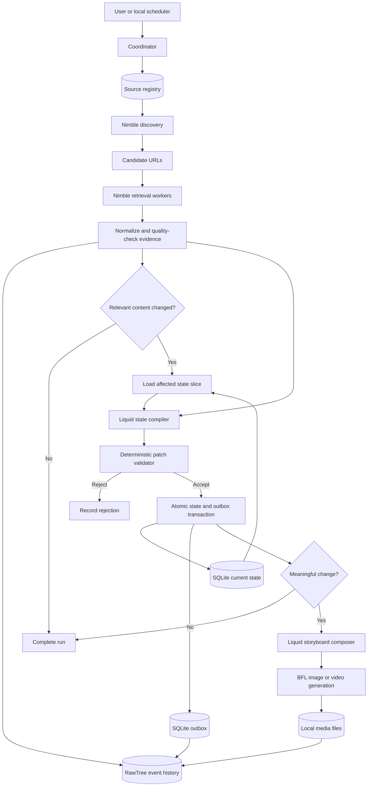

# Long-Horizon Change-to-Video Agent

## Product Requirements Document

| Field | Value |
|---|---|
| Status | Draft |
| Date | 2026-09-25 |
| Runtime | Local-first; no deployment dependency |
| External services | Nimble, Liquid AI, RawTree, Black Forest Labs |

## 1. Executive summary

This product is a long-running intelligence agent that monitors selected parts of the web, detects meaningful changes, maintains a compact and explicit world state, and turns important changes into short visual briefings.

The central product claim is that an agent does not need an ever-growing conversation or observation history to remain reliable over time. The system separates:

1. Immutable evidence of what was observed.
2. A small, mutable projection of what the agent currently believes.
3. An append-only ledger explaining how and why beliefs changed.
4. Derived outputs such as storyboards, images, and videos.

Each monitoring cycle retrieves live evidence with Nimble. Deterministic code removes duplicate, unchanged, or invalid results. Liquid AI receives only new evidence and the relevant slice of current state, then proposes typed operations such as add, replace, confirm, dispute, retract, or expire. Application code validates and applies accepted patches. Meaningful patches are converted into a storyboard and rendered through Black Forest Labs.

The hackathon implementation runs locally with service API keys. SQLite holds current mutable state and a reliable outbox. RawTree holds durable event history, analytical data, and evaluation telemetry.

## 2. Problem statement

Long-horizon agents commonly accumulate raw observations, tool results, intermediate reasoning, and prior outputs in one growing context. Over time this causes:

- Increasing token use, latency, and cost.
- Reprocessing of information that has not changed.
- Stale claims remaining in context after the world changes.
- Contradictory facts being silently overwritten or blended.
- Poor traceability from generated claims to source evidence.
- Greater sensitivity to earlier model mistakes.
- More expensive and less reliable downstream generation.

The product must demonstrate that explicit state mutation can replace history accumulation while preserving accuracy and improving long-run cost, explainability, and reliability.

## 3. Product vision

A user defines an enduring intelligence brief such as:

> Track the pricing, product launches, partnerships, and hiring activity of these competitors. Keep an up-to-date view of what is true. When something important changes, create a short video briefing with evidence.

The agent operates repeatedly without requiring the user to restate context. At any point, the user can inspect:

- What the agent currently believes.
- What changed in the latest run.
- Which evidence supports each belief.
- Which beliefs are stale, disputed, expired, or retracted.
- Why a change did or did not produce media.
- How the stateful system compares with a full-history baseline.

## 4. Goals

### 4.1 Product goals

- Monitor a bounded set of web sources autonomously across repeated cycles.
- Preserve compact, queryable, versioned state instead of a growing prompt history.
- Detect additions, updates, confirmations, contradictions, retractions, and expiry.
- Retain provenance from every belief and media claim to source evidence.
- Generate visual briefings only for meaningful changes.
- Recover safely from duplicate delivery, partial failure, malformed model output, and interrupted runs.
- Make the architecture and its benefit legible in a three-minute demo.

### 4.2 Hackathon goals

- Use all four sponsor services for substantive functions:
  - Nimble for web discovery and retrieval.
  - Liquid AI for structured state compilation and storyboarding.
  - RawTree for event history, analytics, and evaluation.
  - Black Forest Labs for image or video generation.
- Demonstrate bounded model context over a simulated long horizon.
- Compare against a full-history baseline using identical observations.
- Run locally without depending on AWS or another deployment platform.

## 5. Non-goals

The hackathon version will not:

- Monitor the unrestricted web without source or cost bounds.
- Replace a general research analyst for arbitrary questions.
- Allow an LLM to write directly to the state database.
- Treat a missing page or failed scrape as proof that a belief is false.
- Generate media for every page change.
- Implement a general-purpose multi-agent framework.
- Require production deployment or enterprise identity management.
- Provide full video editing, publishing, or collaborative review workflows.

## 6. Target users and initial use case

Target users include founders, product leaders, sales teams, strategy teams, investors, analysts, marketers, and agent developers.

The MVP monitors two or three competitors across:

- Pricing and packaging pages.
- Product, newsroom, and blog pages.
- Careers pages and job listings.

Initial beliefs include:

- Current plan prices.
- Product or feature availability.
- Launch dates or announcement status.
- Hiring counts by function or geography.
- Current partnership or market claims.

## 7. Product principles

1. **State is explicit.** Current beliefs live in a typed store, not an opaque conversation.
2. **Evidence is immutable.** Interpretation never rewrites the original observation.
3. **Models propose; code decides.** Model output is validated before mutation.
4. **Context is retrieved, not accumulated.** Each call receives only relevant state and new evidence.
5. **Retraction is first-class.** Former beliefs can become disputed, retracted, or expired.
6. **Absence is not retraction.** Retrieval failure alone cannot invalidate a belief.
7. **Every claim has provenance.** User-facing claims trace to state and evidence.
8. **Repeated work is skipped.** Unchanged pages stop before a model call.
9. **Media is a view of change.** Media generation does not own canonical state.
10. **Long-run behavior is measurable.** Tokens, latency, errors, and accuracy are recorded per cycle.

## 8. Agent topology

The MVP uses **one stateful coordinator with multiple stateless workers**.

It does not use autonomous agents with separate conversational memories. Separate autonomous agents would introduce coordination histories, state-ownership conflicts, and additional stale-context failure modes.

Workers include:

- Discovery worker.
- Retrieval workers.
- Evidence normalizer and quality gate.
- Change detector.
- Liquid state compiler.
- Deterministic patch validator and reducer.
- Liquid storyboard composer.
- BFL render worker.
- RawTree outbox worker.

Workers may execute concurrently, but only the coordinator and state repository determine lifecycle and state ownership.

## 9. System architecture

## 10. Service responsibilities

### 10.1 Nimble

Nimble is the web acquisition layer:

- Search discovers announcements, news, and corroborating sources.
- Map periodically discovers site structure and stable high-value URLs.
- Extract retrieves known pages repeatedly.
- Crawl performs bounded exploration when site structure is new or materially changed.
- Parsing schemas handle stable structured pages such as pricing.
- Markdown output handles narrative pages.
- JavaScript rendering, browser actions, stealth drivers, and network capture are enabled only by source policy.

References: [Nimble documentation](https://docs.nimbleway.com/home) and [Nimble Extract](https://docs.nimbleway.com/nimble-sdk/web-tools/extract/quickstart).

### 10.2 Liquid AI

Liquid is the bounded reasoning layer. It performs two typed tasks:

1. Compare new evidence with relevant beliefs and propose a state patch.
2. Convert accepted meaningful patches into a structured storyboard.

Liquid does not schedule runs, retrieve arbitrary history, mutate databases, or validate its own output. Its integration is isolated behind a provider adapter so the sponsor endpoint and authentication format can change without affecting the core.

Reference: [Liquid model library](https://docs.liquid.ai/lfm/models/complete-library).

### 10.3 RawTree

RawTree is the remote event memory and analytics layer. Initial tables are:

- observation_events
- patch_events
- run_events
- model_call_events
- media_events
- evaluation_events

The application treats RawTree as append-only. Current mutable state stays in SQLite, and it must be possible to rebuild that state by replaying accepted patches.

SQL triggers are optional for the MVP. They may later call a webhook when significant unrendered patches exist or repeated failures require attention.

References: [RawTree documentation](https://rawtree.com/docs), [ingestion](https://rawtree.com/docs/guides/ingest-data), [querying](https://rawtree.com/docs/guides/query-data), and [SQL triggers](https://rawtree.com/docs/guides/triggers).

### 10.4 Black Forest Labs

BFL is the media generation layer:

- Prefer FLUX 3 for final video when included in sponsor access.
- Use FLUX.2 for keyframes, visual references, thumbnails, or fallback output.
- Store model, prompt, seed, request ID, patch ID, and output path.
- Reuse a visual continuity pack across shots.

Reference: [BFL API introduction](https://docs.bfl.ai/quick_start/introduction).

### 10.5 Local infrastructure

- SQLite in WAL mode stores state, run locks, idempotency records, jobs, and the outbox.
- The local filesystem stores large evidence artifacts and media.
- A local scheduler or manual command initiates monitoring cycles.
- Environment variables or an uncommitted local environment file hold credentials.

## 11. Nimble acquisition subsystem

### 11.1 Watch brief

A versioned watch brief defines objective, entities, topics, regions, and per-run budgets. It is persistent configuration and is never reconstructed from chat history.

Required fields:

| Field | Purpose |
|---|---|
| watch_id | Stable identifier |
| objective | Monitoring intent |
| entities | Companies or subjects in scope |
| topics | Pricing, launches, hiring, and similar categories |
| regions | Relevant geography and locale |
| max_pages_per_run | Hard retrieval bound |
| max_searches_per_run | Hard discovery bound |
| version | Configuration version |

### 11.2 Source registry

Each source has a durable retrieval recipe containing:

- Source, watch, and entity IDs.
- Seed URL and source type.
- Fixed, search, map, or crawl discovery mode.
- Extract or crawl retrieval mode.
- Allowed and denied paths.
- Render and driver policy.
- Locale and geography.
- Parser version and expected fields.
- Trust weight.
- Cadence and retry policy.
- Belief expiry policy.
- Enabled or disabled status.

Parser versions must be recorded with observations so a parser change is not mistaken for a real-world change.

### 11.3 Discovery policy

- Run Map when a source is first registered.
- Re-run Map periodically or after repeated URL failure.
- Run Search at lower frequency to discover new announcements and corroboration.
- Use bounded Crawl only for relevant site sections.
- Promote useful discovered URLs into the source registry.
- Do not rediscover stable URLs during every cycle.

### 11.4 Retrieval escalation

Use the cheapest suitable method and escalate only when necessary:

1. Static HTTP retrieval.
2. Automatic or explicit JavaScript rendering.
3. Browser actions for interaction-dependent content.
4. Stealth-capable driver for protected pages.
5. Network capture when data comes from a structured endpoint.

The selected method, driver, geography, parser, timing, and Nimble task ID are recorded for every observation.

### 11.5 Evidence envelope

Each retrieval becomes a normalized evidence envelope with:

| Group | Fields |
|---|---|
| Identity | observation_id, run_id, source_id, entity_id |
| Retrieval | canonical_url, retrieved_at, Nimble task ID, status code |
| Configuration | driver, locale, parser_version |
| Change detection | content_hash, section_hashes |
| Content | structured fields, relevant markdown |
| Artifacts | local HTML and screenshot paths |
| Quality | parser completeness, content length, suspected block page |

Large HTML, screenshots, and media remain on the local filesystem. RawTree receives their paths, hashes, metadata, and relevant normalized content.

### 11.6 Pre-model change detection

Before calling Liquid:

1. Compare normalized content hashes.
2. Compare hashes for relevant sections.
3. Compare structured extracted fields.
4. Remove known boilerplate such as timestamps and rotating session values.
5. Continue only when a relevant section or field changed.

A retrieval error is recorded but cannot retract a belief.

## 12. State model

### 12.1 Belief

Canonical state consists of independently addressable beliefs:

| Field | Description |
|---|---|
| belief_key | Stable entity-and-attribute key |
| entity_id | Entity being described |
| attribute | Typed attribute path |
| value | Current value |
| status | active, disputed, retracted, or expired |
| confidence | Normalized confidence |
| first_seen_at | First supporting observation |
| last_confirmed_at | Most recent confirmation |
| valid_from | Effective time |
| expires_at | Policy-derived expiry |
| evidence_ids | Supporting observations |
| source_ids | Supporting sources |
| version | Belief version |
| schema_version | Data contract version |

Expired and retracted beliefs remain in patch history but leave the active projection.

### 12.2 Patch

A Liquid patch contains:

- patch_id and run_id.
- base_state_version.
- One or more typed operations.
- belief_key.
- before and after values.
- confidence and significance.
- observed_at timestamp.
- evidence IDs.
- concise reason.

Allowed operations:

- add
- replace
- confirm
- dispute
- retract
- expire

### 12.3 Expiry defaults

| Belief class | Default TTL |
|---|---:|
| Price or promotion | 48 hours |
| Job listing | 14 days |
| Hiring count | 7 days |
| Product availability | 30 days |
| Partnership or launch claim | 90 days |
| Company description | 180 days |

An expiry worker creates ordinary expire patches. Matching new evidence produces confirm and refreshes the confirmation time without creating a false change.

## 13. State compilation

For each affected entity, Liquid receives only:

- Stable instructions and schema version.
- New evidence envelopes for that entity.
- Current beliefs relevant to observed topics.
- Conflict, expiry, and source-authority rules.
- Current base state version.

It does not receive prior chat, unrelated entities, every historical observation, previous rejected patches, or media prompts.

Context size therefore depends on the current change, not on the age of the agent.

## 14. Patch validation and application

Deterministic code must verify:

- Schema conformity.
- Allowed operation types.
- Evidence IDs exist in the current batch.
- Beliefs belong to in-scope entities and topics.
- Before values match current state.
- Base state version matches.
- Evidence is not improperly older than the state it replaces.
- Confidence and significance are valid.
- Required fields exist for the operation.
- Patch ID has not already been applied.
- Configured numeric and categorical sanity checks pass.

Accepted operations and the RawTree outbox event commit in one SQLite transaction.

On a version conflict, the coordinator reloads state and may ask Liquid to rebase once. Repeated conflict fails safely and records the cause.

## 15. Meaningfulness and media gating

Accepted patches do not automatically produce media.

The initial score combines:

- Attribute importance.
- Confidence.
- Source authority.
- Novelty.
- Magnitude.

The media gate also requires:

- A minimum score.
- A cooldown for equivalent changes.
- A debounce window grouping related patches.
- At least one user-relevant claim.
- Sufficient supporting evidence.
- No unresolved high-severity dispute affecting the headline.

Inputs and the final decision are recorded for evaluation.

## 16. Storyboard and media requirements

The storyboard receives accepted patches, supporting evidence, limited surrounding state, a visual style guide, and a duration budget.

It contains:

- Storyboard ID and patch IDs.
- Headline.
- Claims with belief and evidence references.
- Ordered shots with duration, narration, and visual prompt.
- Style ID, seed, and visual references.

Requirements:

- Every factual narration claim references a belief and evidence.
- The composer may improve phrasing but cannot add unsupported facts.
- Prompts reuse a shared visual style block.
- Generated media records patch and storyboard IDs.
- Failed rendering remains retryable and never rolls back state.

## 17. User experience

The MVP may use a CLI, a minimal local web interface, or both.

Required actions:

- Create or load a watch brief.
- Register and inspect sources.
- Run one monitoring cycle.
- Inspect latest evidence.
- Inspect current beliefs.
- Inspect accepted and rejected patches.
- Generate and open a media briefing.
- View evaluation metrics.

Required views:

1. Watch overview.
2. Acquisition funnel.
3. Current state by status.
4. Before-and-after patch with evidence.
5. Storyboard and generation status.
6. Stateful versus full-history evaluation.

## 18. Functional requirements

### FR-1: Watch configuration

- Persist versioned watch briefs.
- Enforce page, query, token, and generation budgets.

### FR-2: Source management

- Persist versioned source recipes.
- Support fixed and discovered URLs.
- Disable repeatedly failing sources without deleting history.

### FR-3: Web acquisition

- Retrieve known pages through Nimble Extract.
- Support Search, Map, and bounded Crawl.
- Record request IDs, settings, timings, and outcomes.

### FR-4: Evidence quality

- Detect empty pages, block pages, unexpected status codes, and incomplete extraction.
- Persist failures without mutating beliefs.

### FR-5: Change detection

- Remove exact duplicates before model invocation.
- Support section-level and structured-field comparison.

### FR-6: State updates

- Request typed patches from Liquid.
- Validate patches before applying them.
- Provide idempotent application and version conflict detection.

### FR-7: Belief lifecycle

- Support active, disputed, retracted, and expired beliefs.
- Run expiry according to configured policy.

### FR-8: Event persistence

- Enqueue observation, patch, run, model, media, and evaluation events.
- Retry failed RawTree delivery without duplicating logical events.

### FR-9: Storyboarding

- Generate a structured storyboard from meaningful accepted patches.
- Reject unsupported storyboard claims.

### FR-10: Media generation

- Submit image or video jobs to BFL.
- Retain prompts, parameters, request IDs, and outputs.

### FR-11: Baseline

- Run a full-history baseline over identical observations.
- Record comparable tokens, latency, cost, and accuracy.

## 19. Non-functional requirements

### Reliability

- Externally visible operations are idempotent.
- Interrupted runs are resumable or safely restartable.
- Media failure cannot corrupt canonical state.
- RawTree failure cannot erase locally committed state.

### Performance

- Unchanged pages do not invoke Liquid.
- Retrieval workers run concurrently within configured limits.
- State queries load only relevant beliefs.
- A no-change run completes without media generation.

### Explainability

- Every active belief identifies supporting evidence.
- Every state transition has a patch record.
- Every factual media claim traces to belief and evidence.

### Security

- API keys are never committed or written to RawTree.
- Logs redact authorization headers, cookies, and configured sensitive fields.
- Authenticated source cookies are excluded from the MVP unless stored safely.
- Retrieval enforces allowed protocols and bounded destinations.

### Portability

- External services use provider adapters.
- Reducer and validator tests require no network.
- Event schemas contain explicit versions.

## 20. Idempotency

Recommended logical identifiers:

- observation_id hashes source, canonical URL, and normalized content.
- patch_id hashes base version, ordered observations, and operations.
- storyboard_id hashes ordered patches and storyboard schema version.
- media_job_id hashes storyboard, model, and generation parameters.

The system tolerates at-least-once delivery from its retries and optional RawTree triggers.

## 21. Failure handling

| Failure | Required behavior |
|---|---|
| Nimble timeout | Retry within budget; keep prior belief |
| Block or login page | Mark invalid; do not call Liquid |
| Parser incomplete | Fall back to markdown if safe; lower confidence |
| Liquid malformed output | Retry once with validation feedback; then reject |
| Unknown evidence citation | Reject patch |
| State version conflict | Reload and rebase once |
| SQLite transaction failure | Apply nothing |
| RawTree unavailable | Retain event in local outbox |
| BFL failure | Retain retryable media job; keep accepted state |
| Process exits mid-run | Resume through expiring locks and idempotency records |

## 22. Observability and metrics

Every run records:

- Sources due and attempted.
- URLs discovered and promoted.
- Pages fetched, invalid, or blocked.
- Exact duplicates skipped.
- Relevant changes sent to Liquid.
- Liquid input and output tokens where available.
- Proposed, accepted, and rejected operations.
- State size and active-belief count.
- Service latency and estimated or reported cost.
- Media gate decision and generation status.
- End-to-end duration.

Primary long-horizon metrics:

- Input tokens per cycle.
- Cumulative tokens.
- Patch precision and recall.
- Unsupported patch rate.
- Stale-belief rate.
- Contradiction-resolution time.
- Evidence coverage per belief.
- Autonomous run success rate.
- Cost per meaningful change.
- Time from web change to briefing.

## 23. Evaluation design

The stateful system receives only new evidence and relevant current beliefs.

The baseline continually appends new observations and prior conclusions to a growing history.

Fairness requirements:

- Same observations in the same order.
- Same target belief schema.
- Same model family and deterministic settings where possible.
- Measurements at 1, 10, 50, 100, and 500 cycles.
- Evaluation against labeled expected patches and query answers.

Test scenarios:

- A price changes once and remains stable.
- A product claim is contradicted by a more authoritative source.
- A job listing disappears for one run and returns.
- A promotion expires.
- A parser changes while page meaning does not.
- Irrelevant page elements change frequently.
- The same event is delivered twice.
- Evidence arrives out of order.

## 24. MVP scope

- One watch brief.
- Two or three monitored entities.
- Pricing, product/news, and careers sources.
- At least five belief attributes.
- Three robust Nimble extraction recipes.
- SQLite state and outbox.
- RawTree observations, patches, runs, and evaluations.
- Liquid state compiler with schema validation.
- Confirmation, replacement, dispute, retraction, and expiry.
- Meaningfulness gate.
- One short storyboard and BFL-generated output.
- Repeatable stateful-versus-history evaluation.

## 25. Proposed implementation stack

Recommended:

- Python 3.12.
- Pydantic for schemas.
- SQLite with WAL mode and migrations.
- SQLAlchemy or SQLModel.
- httpx for asynchronous service clients.
- asyncio with bounded retrieval concurrency.
- APScheduler or a simple interval loop.
- Typer for the CLI.
- FastAPI for an optional dashboard or webhook.
- Pytest with fixture-based service responses.
- FFmpeg only if generated images require local assembly.

Suggested commands:

- agent init
- agent source add URL
- agent discover WATCH_ID
- agent run WATCH_ID
- agent state show ENTITY_ID
- agent patch show PATCH_ID
- agent render PATCH_ID
- agent evaluate SCENARIO

## 26. Team workstreams

### Acquisition

- Source registry and discovery policy.
- Nimble integrations and extraction recipes.
- Evidence normalization, hashing, and quality gates.

### State and agent core

- SQLite schema and repositories.
- Liquid state compiler.
- Patch validator and deterministic reducer.
- Expiry, retraction, and idempotency.

### Data and evaluation

- RawTree client and outbox delivery.
- Analytical queries and evaluation events.
- Full-history baseline and metrics.

### Output

- Storyboard schema and Liquid prompt.
- Claim validation.
- BFL generation and media persistence.
- Demo playback experience.

## 27. Milestones

### Milestone 1: Vertical slice

- Retrieve one page with Nimble.
- Normalize and store its observation.
- Produce and validate one Liquid patch.
- Apply it to SQLite and enqueue it for RawTree.

### Milestone 2: Repeated monitoring

- Add source recipes, hashing, no-change skipping, and expiry.
- Demonstrate multiple cycles with bounded Liquid context.

### Milestone 3: Media path

- Score a meaningful patch.
- Generate a structured storyboard.
- Produce and save BFL output.

### Milestone 4: Evaluation and demo

- Run long-horizon replay against the baseline.
- Display tokens, accuracy, stale-belief rate, and cost.
- Rehearse the three-minute demo.

## 28. Three-minute demo

1. Show the watch brief and current belief that a plan costs $99.
2. Run the monitoring cycle.
3. Show the acquisition funnel: pages fetched, unchanged pages skipped, and one relevant change.
4. Open Nimble evidence showing the new $79 value.
5. Show Liquid's single proposed replace operation.
6. Show deterministic validation and the state version advancing.
7. Show the generated storyboard and BFL output.
8. Finish with the stateful-versus-history graph: bounded context with comparable or better accuracy.

## 29. Acceptance criteria

The MVP is complete when:

- A user can configure and run a watch locally with API keys.
- Nimble retrieves live evidence from at least three source classes.
- Identical observations do not invoke Liquid twice.
- Liquid receives only changed evidence and relevant beliefs.
- Malformed, unsupported, duplicate, or stale patches cannot mutate state.
- The system represents confirmation, replacement, dispute, retraction, and expiry.
- Every active belief and factual media claim links to evidence.
- Events reach RawTree after local commit, including after simulated delivery failure.
- A meaningful patch can produce BFL media.
- A failed BFL request does not affect accepted state.
- Evaluation demonstrates bounded stateful context across repeated cycles.
- The value proposition can be demonstrated in three minutes.

## 30. Risks and mitigations

| Risk | Mitigation |
|---|---|
| Target pages are unstable | Versioned parsers, markdown fallback, section hashing |
| Scrape failure looks like retraction | Separate retrieval health from semantic evidence |
| Model fabricates a change | Evidence enforcement and before-value checks |
| State becomes inconsistent | Single reducer, versions, atomic transactions |
| Duplicate events create duplicate media | Deterministic IDs and cooldowns |
| Video generation is slow | Fallback image output and pre-generated demo assets |
| Sponsor endpoint differs from public docs | Provider adapters and fixture-driven tests |
| Evaluation favors one design | Same evidence, model, schema, and scoring rubric |
| Scope expands during the hackathon | Fix entities, sources, beliefs, and output duration |

## 31. Open questions

- Which Liquid endpoint, model, authentication format, and structured-output features are included?
- Does BFL access include FLUX 3 video, or should the MVP use FLUX.2 keyframes?
- Which domains provide the most reliable and compelling live demo?
- Should the demo use a controlled page change, recorded replay, or both?
- What page and token budgets apply to each cycle?
- Which beliefs require two independent sources before replacement?
- Are RawTree SQL triggers useful for the demo or better deferred?
- Is the primary interface a CLI, a lightweight dashboard, or both?

## 32. Future extensions

- Multiple isolated watch briefs.
- Human approval for high-impact or low-confidence patches.
- Source-authority learning based on historical accuracy.
- Parser repair suggestions.
- Cross-entity trend detection.
- Daily or weekly briefing compilation.
- Multi-language monitoring and localized media.
- Collaborative review and publishing.
- Separate domain agents only when permissions or schemas require independent ownership.
