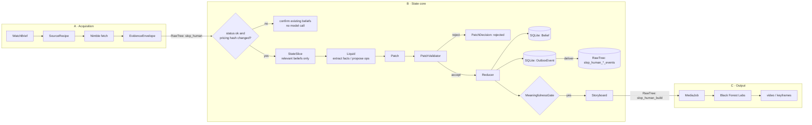

# Architecture: A → B → C

How the three workstreams connect. Product scope, requirements and rationale live in [PRD.md](../PRD.md); this file covers ownership and the contracts at each boundary. Decisions that refine the PRD are in [DECISIONS.md](DECISIONS.md).

## Flow



## Ownership

| Workstream | Owns | Writes | Never touches |
|---|---|---|---|
| **A · Acquisition** | Sources, Nimble recipes, normalization, hashing, retrieval status | `slop_human` (observations) | Beliefs, patches |
| **B · State core** | Change gate, Liquid calls, validation, reducer, beliefs, outbox, meaningfulness, storyboard, run metrics | SQLite state + outbox; `slop_human_{patch,run,model_call,evaluation}_events`; `slop_human_build` | Raw pages after reading them |
| **C · Output** | Rendering the storyboard with BFL, overlays, voiceover, assembly | `slop_human_media_events`; media files | Beliefs; C never adds facts |

## Contracts at each boundary

All in [`contracts/`](../contracts). Pydantic v2.

| Boundary | Class | File | Carried by |
|---|---|---|---|
| A config | `WatchBrief`, `SourceRecipe` | `evidence.py` | config files |
| **A → B** | `EvidenceEnvelope` | `evidence.py` | RawTree table `slop_human` |
| B internal | `StateSlice`, `Belief`, `Patch`, `PatchOp`, `PatchDecision` | `state.py` | SQLite |
| B → RawTree | `OutboxEvent`, `RunRecord`, `ModelCallRecord` | `events.py` | RawTree `slop_human_*_events` |
| **B → C** | `StoryboardRecord` wrapping `Storyboard`, `Scene`, `Claim`, `StyleGuide` | `output.py` | RawTree `slop_human_build` |
| C | `MediaJob` | `output.py` | RawTree `slop_human_media_events` |

The contracts enforce the PRD's rules at the type level:

- `EvidenceEnvelope.usable` is true only for `status == ok`, so a blocked page can't retract a belief (PRD principle 6).
- `PatchOp` rejects `add`/`replace`/`confirm`/`dispute` without evidence, `replace` where before == after, and `add` with a before value.
- `Storyboard` rejects a change scene that cites no `Claim`, a claim ID that doesn't exist, and durations that don't sum to the total. Every spoken fact traces back to belief → patch → evidence.

## One cycle

1. **A** fetches each due source and writes one `EvidenceEnvelope` per fetch, including failures.
2. **B** reads new rows (cursor on `fetched_at`) and skips `status != ok`.
3. If `section_hashes.pricing` is unchanged, B reuses the last reading: no Liquid call, and existing beliefs are confirmed.
4. Otherwise B builds a `StateSlice` (that entity's relevant beliefs only) and calls Liquid.
5. The result becomes a `Patch`, and the `PatchValidator` accepts or rejects it with reasons.
6. The `Reducer` applies accepted ops to `Belief` and writes an `OutboxEvent` in the same SQLite transaction, then the outbox delivers to RawTree.
7. The `MeaningfulnessGate` scores accepted ops. If any pass, B writes a `Storyboard`.
8. B inserts it as a `StoryboardRecord` into `slop_human_build`.
9. **C** renders it as `MediaJob`s. A render failure never touches state.

What Liquid sees each call is bounded by one entity's beliefs plus one new page. It does not grow with the number of cycles, and `RunRecord.state_tokens` is what proves it in the demo.

## Storage

| Store | Holds | Why |
|---|---|---|
| SQLite (local, WAL) | Current `Belief`s, state version, outbox, idempotency records | Mutable and transactional. Rebuildable by replaying patches |
| RawTree (shared with every team!) | Observations and all events, append-only | History, analytics, the evaluation chart |
| Local files | HTML/screenshots (optional), media | Large blobs |

RawTree is shared with other hackathon teams: only ever read and write tables starting with `slop_human`.

## B → C handoff via `slop_human_build`

A, B and C run on different machines, so storyboards travel through RawTree rather than a local file.

- **B** inserts a `StoryboardRecord`: metadata columns plus the full `Storyboard` as one JSON string (`storyboard_json`). RawTree would flatten a nested scene list into dotted columns.
- **C** polls for storyboards that aren't rendered yet, then parses them with `StoryboardRecord(**row).storyboard()`:

  ```sql
  SELECT * FROM slop_human_build
  WHERE is_test = false
    AND storyboard_id NOT IN (SELECT storyboard_id FROM slop_human_media_events WHERE status = 'done')
  ORDER BY created_at
  ```

- **C** records progress by inserting `MediaJob` rows into `slop_human_media_events`. RawTree rows are never updated, only added.
- A corrected storyboard gets a new `storyboard_id`. Test rows set `is_test = true`.
